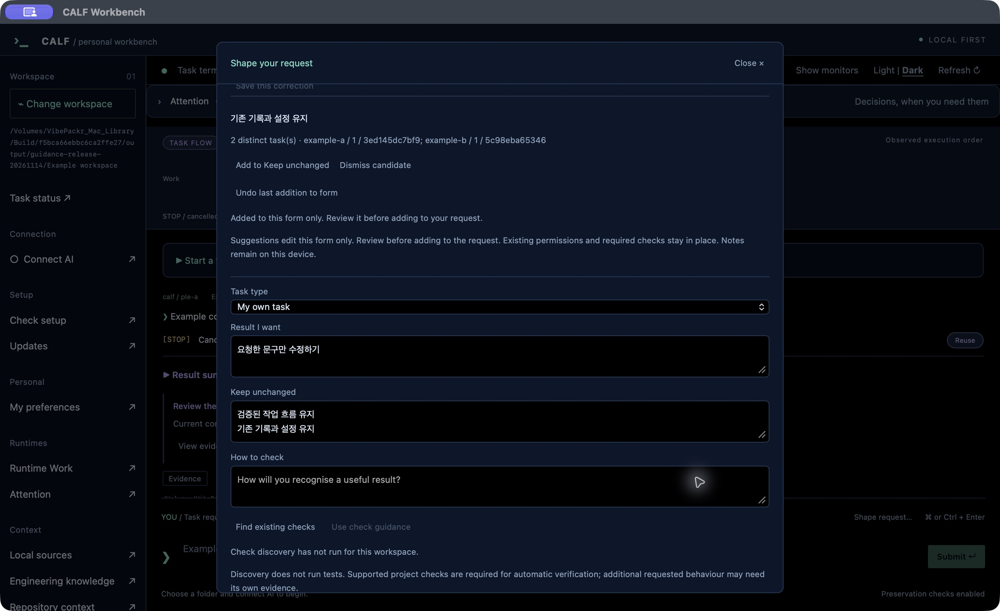
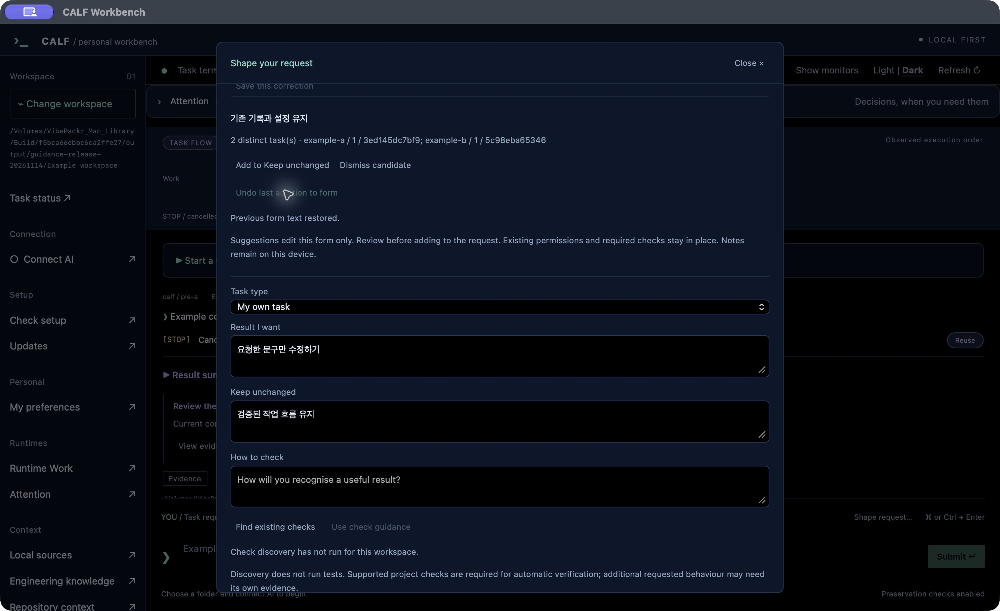
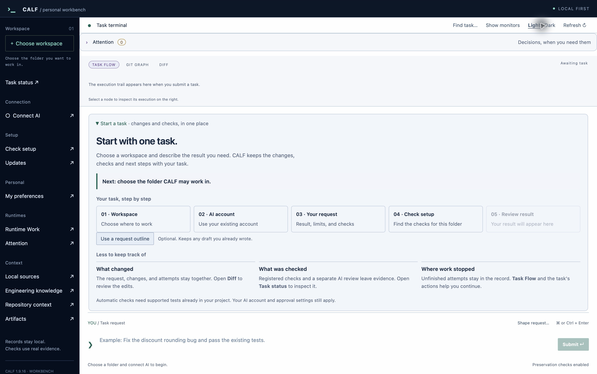
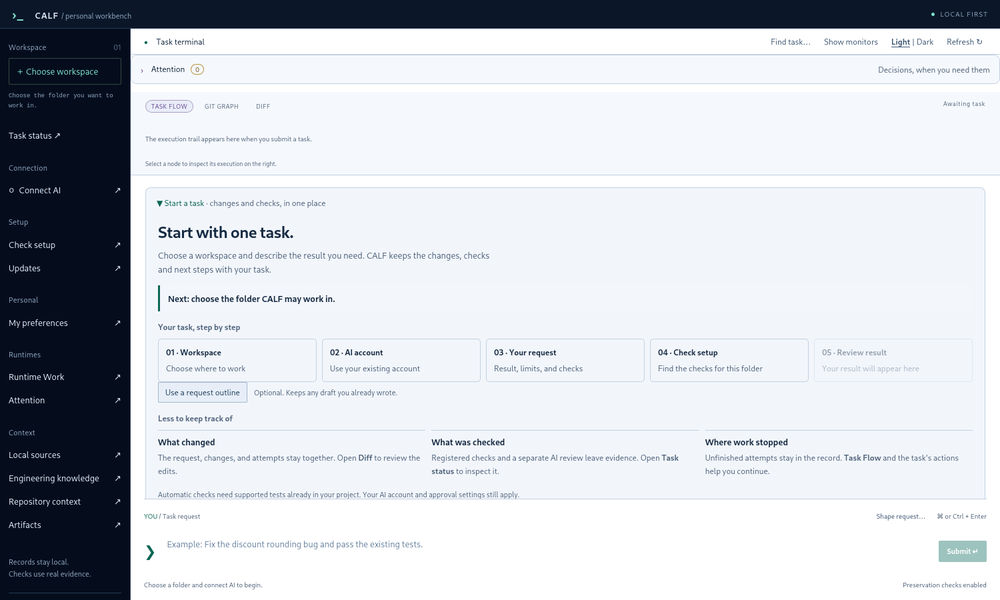
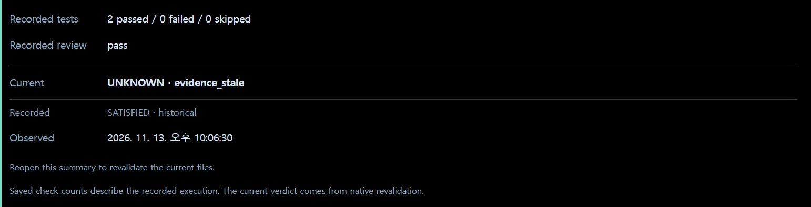

# Workbench 1.9.26 화면 안내
## Workbench 1.9.26 — 작업 공간 확보와 근거 그래프 조작

작업 관측 영역과 작업 기록 영역을 각각 스크롤합니다. Task Flow·Git Graph·Diff를 바꿔도 **Start a task**와 실행 기록에 필요한 공간을 유지합니다. 경계선을 끌어 비율을 조절하거나, 경계선에 초점을 두고 방향키를 사용하세요. Enter는 기본 비율로 되돌립니다.

**Evidence graph**에서 노드를 끌어 배치하고, 배경을 끌거나 스크롤하여 이동합니다. 확대·축소 버튼 또는 Ctrl/⌘ + 휠을 사용할 수 있습니다. **Fit to view**는 화면에 맞추고 **Reset layout**은 처음 배치로 복원합니다. 초점이 있는 노드는 Shift + 방향키로 이동할 수 있습니다. 화면을 위한 임시 조작이며 근거 기록·관계·완료 판정은 변경하지 않습니다.

Git Graph는 기존의 로컬 커밋·브랜치 보기입니다. 병합, 로컬 변경, 충돌, 분리된 HEAD, 로컬 추적 참조의 앞섬·뒤처짐을 표시하며 최근 커밋 최대 20개를 조회합니다. fetch나 저장소 변경은 수행하지 않습니다. 파일 의존 관계 그래프는 별도 보기이며 이번 변경에 포함하지 않습니다.

1.9.25의 Updates를 사용하거나 1.9.26을 새 폴더에 풀고 기존 기록 위치를 유지하세요. 이전 설치본과 롤백을 보존합니다. Harness 1.8.25와 SDK 0.2.11은 변경하지 않습니다. [업데이트 안내](UPDATE.md) · [온라인 매뉴얼](https://calf.vibepackr.com/manual/?lang=ko#workspace-graphs).

## Workbench 1.9.25 — 업데이트와 롤백을 간결하게

Updates에는 **실행 중인 버전**, **검증된 새 업데이트 후보 최대 하나**, **검증된 직전 롤백 버전**을 표시합니다. 이전 버전의 창이 계속 열려 있으면 선택된 버전과 구분해 알려줍니다. 업데이트 후보는 실행 중인 버전과 선택된 버전 모두보다 새로워야 합니다.

이전 설치본은 접힌 **Retained versions**에서 버전별로 묶어 조회합니다. 실행 버튼을 반복하지 않으며 파일은 그대로 보관합니다. 업데이트 후보나 직전 버전의 검증에 실패하면 해당 실행 기능을 비활성화하고 이유를 표시합니다. 실제 업데이트·롤백 때는 기존 네이티브 경로가 파일을 다시 검증합니다.

자동 다운로드나 자동 버전 전환은 없습니다. 기록·계약·설정·감사 이력·작업별 고정 런타임을 보존하며, 보관 목록 조회는 기존 로컬 항목 32개 한도를 유지합니다. Harness 1.8.25와 SDK 0.2.11은 변경하지 않습니다.

1.9.24의 Updates를 사용하거나 1.9.25를 새 폴더에 풀고 기존 기록 위치를 유지하세요. [업데이트 안내](UPDATE.md) · [온라인 매뉴얼](https://calf.vibepackr.com/manual/?lang=ko#update-view).

## Workbench 1.9.24 — 작업 흐름과 중단 이유 확인

**Flow**와 **History**에서 같은 최근 검증 기록을 흐름도와 시간순 목록으로 전환합니다. 작업 요청·기록된 상태·확인 가능한 상태 설명을 함께 보여줍니다. 단계를 선택하면 기록·작업 정보를 읽고, **Task evidence**에서 현재 검증 상태를 확인할 수 있습니다.

**Review requests**로 Attention을 열고 **Needs review**, **Observation gaps**, **All observed**로 같은 제한된 네이티브 조회 결과를 나눠 봅니다. 카드에는 과거 결과와 현재 완료 여부를 구분하고, 관측 시각과 근거 참조를 표시합니다. 작업을 열어 근거를 읽은 뒤 기존 검토 기능을 사용하세요.

기존 기록을 읽는 화면 개선입니다. 별도 실행 엔진·작업 DB·자동 승인·원격 승인·호스트 작업 제어를 추가하지 않습니다. 이전 기록과 작업별 고정 런타임을 보존하며 Harness 1.8.25와 SDK 0.2.11은 유지합니다.

Workbench 1.9.23의 Updates를 사용하거나 1.9.24를 새 폴더에 풀고 기존 기록 위치를 유지하세요. [화면 안내](WORK_STATE_VIEW_KR.md) · [온라인 매뉴얼](https://calf.vibepackr.com/manual/?lang=ko#work-state).

## 1.8.25 / 1.9.23 — 과거 장애 평가·반증 검증·이벤트 재개

과거 장애의 정답·미래 자료를 분리하고 진단과 보고서를 별도 평가합니다. 가설·반례·대안을 실제 네이티브 CHECK에 결속하며, 명시적으로 등록한 이벤트로 지정 관리 작업만 재개합니다. 중복·만료 이벤트와 중단 후 불확실한 재실행을 차단합니다. 기존 기록·계약·설정과 작업별 고정 실행기를 보존합니다.

CLI와 공통 API의 `calf evaluation`·`calf events`로 사용합니다. [사용법과 필드](WORKFLOW_HARDENING_KR.md) · [온라인 매뉴얼](https://calf.vibepackr.com/manual/?lang=ko#workflow-hardening). SDK 0.2.11은 유지합니다.

Workbench 1.9.22의 Updates를 사용하거나 1.9.23을 새 폴더에 푸세요. 기존 기록 폴더와 작업별 고정 실행기는 유지하며, 연결 작업은 원래 호스트에서 계속됩니다.

## Workbench 1.9.22 — 연결 작업 상태 조회

Connected tasks에서 카드를 누르면 해당 호스트 작업의 기록을 읽습니다. 작업 폴더를 선택하기 전에도 사용할 수 있습니다. Refresh status는 현재 선택한 같은 작업을 다시 조회합니다.

작업이 제한된 목록이나 갱신된 목록에서 빠져도 선택한 ID를 유지해 그 작업을 직접 조회합니다. 연결을 읽을 수 없으면 다른 작업의 결과를 대신 보여주지 않고 오류를 표시합니다. 기존 호스트 연결을 확인한 뒤 다시 조회하세요. 읽기 전용 조회를 위해 작업을 재시작할 필요는 없습니다.

Response ended는 호스트의 응답 종료 기록입니다. 프로세스의 실행 여부나 전체 작업의 완료를 입증하지 않습니다. 현재 완료 여부를 평가하지 않았으면 UNKNOWN을 유지합니다.

좌측 메뉴의 보조 패널은 중앙 작업 영역에 표시됩니다. Close 또는 Esc로 작업 화면에 돌아갑니다. 패널을 전환해도 저장하지 않은 환경설정 초안은 유지되며, Save preferences를 눌러야 저장됩니다.

Workbench 1.9.21의 Updates에서 확인하거나 1.9.22를 받아 새 폴더에 압축을 푸세요. 기존 기록 폴더·계약·환경설정과 작업별 고정 런타임을 유지합니다. 업데이트를 준비하는 동안 현재 창은 계속 실행되며 연결된 작업은 원래 호스트에서 계속됩니다.

[English](UI_GUIDE.md) · [설치](INSTALL_KR.md) · [첫 작업](FIRST_TASK_KR.md)

## 온톨로지 근거 탐색

현재 안내: Harness **1.8.25** · Workbench **1.9.23** · SDK **0.2.11**.

작업 하나의 근거 그래프, 오래된 기록 검색·페이지 이동, 주변·역참조·경로 탐색과 직접·간접 영향 후보를 읽기 전용으로 확인합니다. 기존 기록·계약·설정과 작업 실행을 보존합니다. [사용법](ONTOLOGY_GUIDE_KR.md)

## 1.9.20 연결된 작업

**Connected tasks** 카드에서 명시적으로 연결한 CALF 호스트 기록을 선택하세요. **Task status**는 기록된 결과와 현재 관측을 구분합니다. 카드 갱신과 최신 응답 추적은 작업 실행을 제어하지 않습니다. [안내](HOST_TASKS_PATCH_KR.md). 아래 화면 예시는 각 사진의 이전 버전 표시를 유지합니다.

## 1.9.19 화면과 작업 상태

보조 화면은 중앙에 표시되며 Close 또는 Escape로 닫습니다. 작성하던 내용은 유지됩니다. **Task status**에서 폴더별 보관 작업을 선택하고 과거 결과와 현재 관측을 구분해 확인하세요. [변경 안내](UI_STATUS_PATCH_KR.md). 아래 사진은 표시된 이전 버전의 예시입니다.

## 반복 수정 제안 추가·되돌리기

**Shape request… → Things I keep correcting**에서 제안을 불러와 원래 문구 뒤에 넣거나 되돌립니다. [단계별 사용법](REQUEST_GUIDANCE_KR.md)을 따라 해보세요.

아래 첫 작업·결과 사진은 기존 1.9.16 배포본의 예시를 보존한 것입니다.

## 첫 작업에서 확인할 것

**Start a task**의 다음 안내를 먼저 읽고 폴더·AI 연결·요청·검사 준비·결과를 이어갑니다. 일반 설명은 시스템 글꼴, 경로·명령·기록은 고정폭 글꼴로 구분합니다.

## 결과를 읽는 순서

| 표시 | 의미 |
| --- | --- |
| Current | 현재 파일·실행 문맥에 대한 네이티브 판정 |
| Recorded | 당시 실행에서 보존한 과거 결과 |
| Next | 근거 확인·재검수 등 필요한 다음 행동 |

과거 SATISFIED가 있어도 현재 근거가 오래됐으면 UNKNOWN으로 남습니다. 버튼 클릭·AI의 완료 보고·명령 exit 0만으로 성공 처리하지 않습니다. Attention은 사람이 확인할 사유와 다음 조치를 보여주며 자동 승인·재실행은 하지 않습니다.

## 화면과 기록 보존

Light/Dark는 중앙 작업 영역을 전환합니다. Show/Hide monitors는 창의 모니터 표시를 바꿉니다. 새 작업을 제출하지 않은 한글 초안도 유지됩니다. 흰색 앱 아이콘은 원본을 보존하고 모서리 반경만 변 길이의 18%로 적용했습니다.

사진은 최종 배포 실행 파일을 별도 예제 기록으로 연 실제 창입니다. 결과 예시는 합성 작업의 기술 검증이며 실제 AI 제작물이나 사용자 작업을 공개한 것이 아닙니다. 세 OS의 화면 검증·UI 회귀 검사와 공개 패키지 검증은 VERIFICATION.json에서 구분합니다. 사람의 작업 시간·토큰 절약률이나 장시간 성능을 측정한 자료는 아닙니다.

## 개인 자료 추가

**Engineering knowledge → Add a material folder…**에서 Markdown·텍스트 폴더를 선택하면 검사와 검색용 색인 생성 후 새 작업에 자동 연결합니다. 자료 추가 자체는 AI를 호출하지 않으며, 이후 AI 작업을 시작하면 선택한 발췌문이 연결된 AI에 전달됩니다. 기존 자료 선택과 원본 파일은 보존합니다. [범위와 사용법](ENGINEERING_KNOWLEDGE_KR.md).
